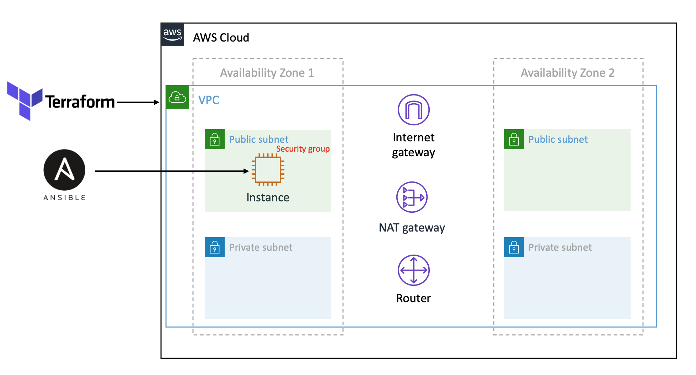

## Infraestrutura como código utilizando Terraform e Ansible

Nesse repositório você encontra todos os códigos utlizados em nossa primeira live, você pode assistir o vídeo aqui
[](https://www.youtube.com/watch?v=iLz_hA8YRDo)

Neste exemplo, apresentamos brevemente como provisionar recursos computacionais na AWS utilizando Terraform e como configurar de forma automática uma instância EC2 com Ansible após sua criação.

Abaixo diagrama abaixo dos recursos provisionados na AWS.



## Requisitos

- Possuir uma conta na AWS
- Possuir o Terrform e o Ansible em instalado em sua máquina local ou qualauqer outra onde será orquestrado o provsionamento
  - <a href="https://learn.hashicorp.com/terraform/getting-started/install.html" target="_blank">Instalação do Terraform</a>
  - <a href="https://docs.ansible.com/ansible/latest/installation_guide/intro_installation.html" target="_blank">Instalação do Ansible</a>
- Usuário específico para esse propósito com as devidas permissões (lembre-se, das melhores práticas de segurança, como o de seguir o princípio do menor privilégio e não utilizar a conta root) para criação dos recursos necessários
- Chaves de acesso do usuário para fazer solicitações seguras de protocolo REST ou HTTP query às APIs de serviço da AWS. Para sua proteção, você nunca deve compartilhar suas chaves secretas com ninguém. Como prática recomendada, efetuar a rotação com frequencia das chaves
- Key Pair para ser attachada à instância EC2 durante o provisionamento para acesso futuro

## Hands On

Clone do repositório
```
$ git clone https://github.com/techstage/iac.git
```

Estrutura do diretório
```
iac
│   README.md
└───ansible
|   └───inventory
│   |   └───hosts.cfg
│   └───roles
|   |   └───nginx
|   |       └───tasks
|   |           └───main.yml
│   └───techstage-playbook.yml
└───terraform
    └───instances.tf
    └───main.tf
    └───outputs.tf
    └───run-ansible.sh
    └───templates
        └───hosts.tpl
```

Editar o arquivo main.tf dentro do diretório terraform e adicionar informações de acesso
```
provider "aws" {
  region     = "us-east-1"
  access_key = "my-aws-access-key"
  secret_key = "my-aws-secret-key"
}
```

Ou se preferir utlizar como no próprio exemplo
```
  provider "aws" {
  region     = "us-east-1"
  shared_credentials_file = "~/.aws/credentials"
}
```
Nesse caso você precisa possuir ou instalar o <a href="https://docs.aws.amazon.com/pt_br/cli/latest/userguide/install-cliv2.html" target="_blank">AWS CLI</a> e após instalado configurá-lo

```
$ aws configure
AWS Access Key ID [None]: my-aws-access-key
AWS Secret Access Key [None]: my-aws-secret-key
Default region name [None]: us-east-1
Default output format [None]: json
```
Note que em ambas as formas você também pode especificar a região desejada

Após as credenciais estarem configuradas iremos iniciar o terraform. De dentro do diretório terraform execute o seguinte comando
```
$ terraform init
```

Uma vez inicializado, podemos executar um plano para verificar se esta tudo certo com os arquivos de configurção e ao mesmo tempo checar todos os recursos que serão aplicados
```
$ terraform plan
```

E por fim aplicar as configurações
```
$ terraform apply
```
Um pedido de confirmação será solicitado, é só confirmar e aguardar e ao finalizar será exibido uma saída com as informações configuradas no arquivo output.tf

Com a infra provisionada, agora será necessário configurar a instância EC2 e fazer o deploy das aplicações através de um playbook do ansible

```
$ ./run-ansible.sh
```
